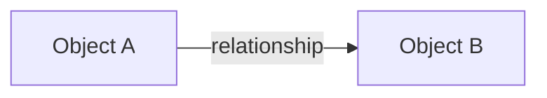

# Product Model Template

```markdown
---
doc_type: product-model
status: <repository-defined status>
owner:
version_horizon:
source_inputs: []
decisions: []
related_prds: []
---

# Product Model: <Product / Domain>

## 1. Model boundary

What is included and excluded from this model?

## 2. Glossary

| Term | Definition | Includes | Excludes | Synonyms / legacy terms | Owner |
| --- | --- | --- | --- | --- | --- |

## 3. Actors and responsibilities

| Actor | Goal | Responsibility | Decision authority | Data visibility | Delegation / recusal | Entry / exit |
| --- | --- | --- | --- | --- | --- | --- |

## 4. Business object catalog

| Object ID | Name | Definition | Identity assigned when | Owner | Created by | Closed by | Sensitive data | Retention | Lifecycle reference |
| --- | --- | --- | --- | --- | --- | --- | --- | --- | --- |

## 5. Object relationships

| Source object | Relationship | Target object | Cardinality | Lifecycle effect | Notes |
| --- | --- | --- | --- | --- | --- |



## 6. Product invariants

| Invariant ID | Statement | Objects / actors affected | Source / decision | Acceptance reference |
| --- | --- | --- | --- | --- |

## 7. Lifecycle index

| Object | Business state | Approval state | Task state | Time state | Visibility state | Archive state | SSoT reference |
| --- | --- | --- | --- | --- | --- | --- | --- |

## 8. Workflow index

| Workflow ID | Trigger | Outcome | Primary object | Actors | Specification reference |
| --- | --- | --- | --- | --- | --- |

## 9. Rule families

## 10. Permission model summary

## 11. Files, artifacts, notifications, and logs

| Artifact | Business meaning | Source object | Version behavior | Visibility | Retention / deletion |
| --- | --- | --- | --- | --- | --- |

## 12. Metric and quality index

## 13. Open decisions and model risks

## 14. Change log
```
